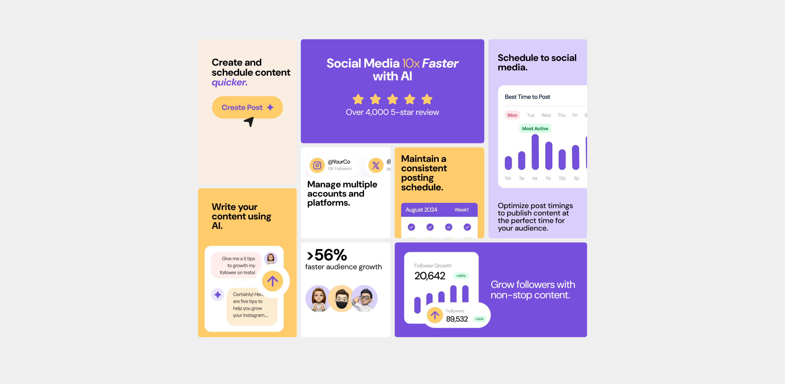

# Bento Grid - Prática de HTML e CSS

Este repositório contém o projeto **Bento Grid**, desenvolvido como parte de um desafio do Frontend Mentor. O objetivo principal foi criar um layout responsivo utilizando **CSS Grid Layout**.

## Objetivo

Este projeto foi criado para consolidar os conhecimentos em:
- Estruturação de páginas com HTML semântico.
- Estilização avançada com CSS, utilizando Grid Layout.
- Adaptação do layout para diferentes dispositivos com media queries.

## Exemplo do Projeto

Abaixo estão prévias de como o projeto se apresenta em diferentes dispositivos:

### Versão Desktop


### Demonstração do Projeto - Versão Mobile  
Aqui está um vídeo mostrando o funcionamento do projeto na versão mobile:  


## Tecnologias Utilizadas

- **HTML5**
- **CSS3**
  - CSS Grid Layout
  - Media Queries para responsividade
  - Variáveis CSS para cores e tipografia
- **Google Fonts**
  - DM Sans

## Estrutura do Layout

- **Main Grid**: Composta por:
  - Imagens ilustrativas organizadas em uma estrutura responsiva.
  - Descrições de funcionalidades.

## Estrutura do Projeto

- `index.html`: Arquivo principal com a estrutura da página.
- `src/css/reset.css`: Reset CSS para padronizar os estilos.
- `src/css/variaveis.css`: Declaração de variáveis de estilo.
- `src/css/desktop.css`: Estilos principais para a versão desktop.
- `src/css/responsive.css`: Estilos específicos para dispositivos menores.

## Responsividade

O projeto foi desenvolvido inicialmente para a versão desktop, com ajustes para dispositivos menores utilizando **media queries**. Adaptações incluem:
- Reorganização do layout em colunas e linhas mais simples.
- Ajuste dos tamanhos das fontes e espaçamentos.
- Reordenação dos elementos no grid.

## Como Visualizar o Projeto

1. Clone este repositório:
   ```bash
   git clone <https://github.com/andreia-tofoli/bento-grid-main.git>
